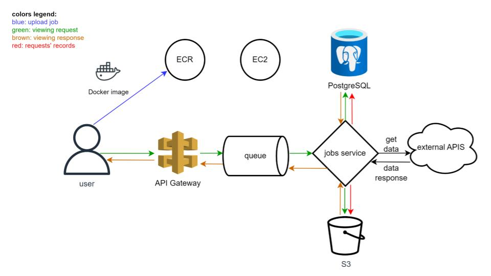
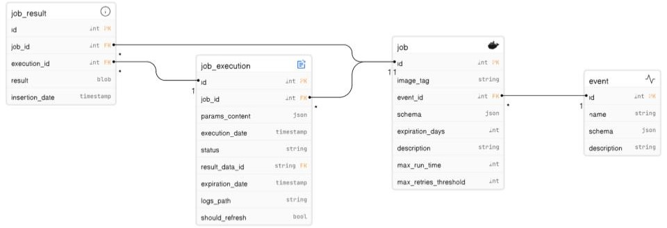

# Welcome to the Jobs Management System

# The App's Purpose
The system is aimed to:
1. Manage and execute jobs which collect data and persist it into the DB
2. Keep previously stored data up to date

New jobs can be uploaded to the system by the user, 
with the configuration required to run those jobs in the future 
(e.g. the names and types of parameters required for the job’s execution).

A new record added to the DB as a result of a job’s execution 
is stored with an expiration date, and once the expiration date is met - 
the corresponding job will be executed with the relevant parameters 
in order to store fresh data in the DB instead of the outdated information.

# System Architecture

# Entity Relationship Diagram

# Design Doc
You can read the design doc 
[here](https://docs.google.com/document/d/1EX202PGvCSkVp-FwXjlsdct1J9u9vD6oycrHBfTc_E0/edit?usp=sharing)

# Tech Stack
* Python
* Flask
* Docker
* PostgreSQL
* AWS: ECR (in the future: EC2, API Gateway, S3, SQS)